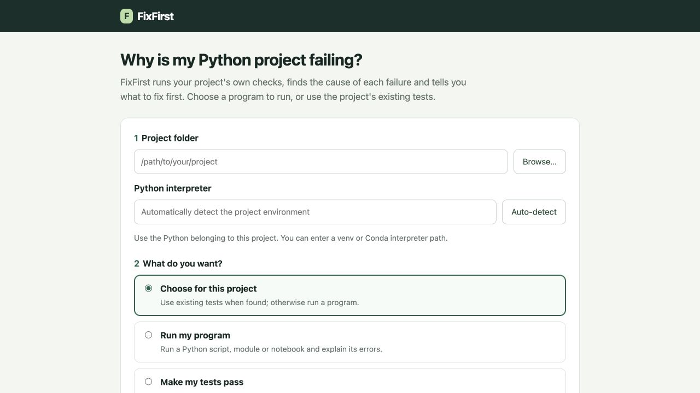
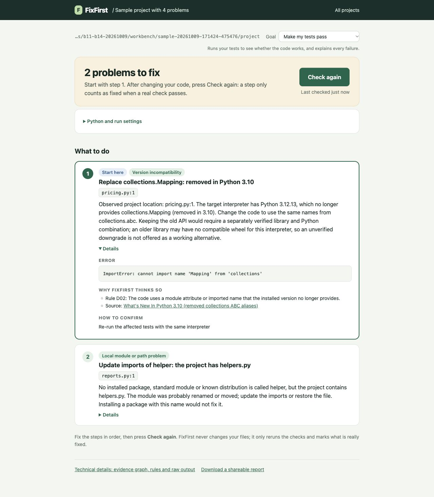
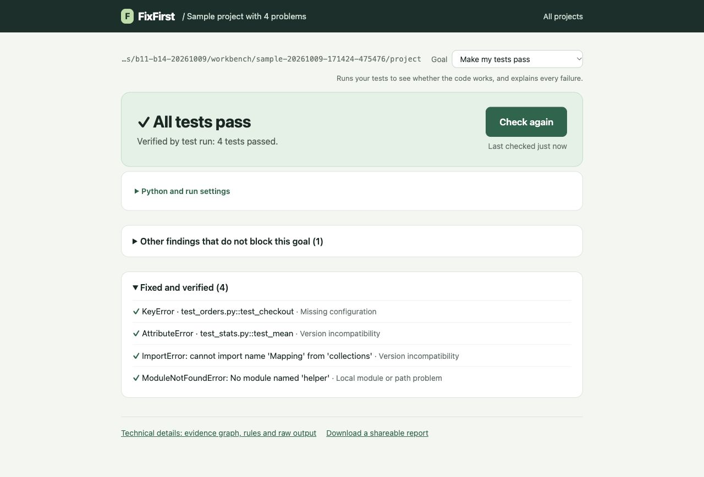

# FixFirst installation and user guide

This guide covers the frozen v0.8 product at `b7-freeze-20261007` (commit `5c224cf`, package version `0.8.0rc2`). Use the browser or command line to diagnose your project, or connect the same checks to a coding agent through MCP. You make the changes; FixFirst checks their effect.

## 1 What you need

Use macOS, Linux or Windows 10/11 with Python 3.10 or later to install FixFirst. Python 3.12 is a convenient choice. Git is optional if you download the source ZIP instead. First installation needs internet access.

There are **two Python environments**: FixFirst's `.venv` runs the tool; your project's environment runs the code you want to check. Select the project's Python in the interface. The target can be a supported Python 3.9 to 3.14 environment, including venv or Conda. Do not install project dependencies into FixFirst's environment by mistake.

Checks run project code, just as its tests or program do. Use projects you trust. FixFirst's normal checks do not need a language model or API key.

## 2 Install and start

If you downloaded the source ZIP, extract it and open a terminal in that folder. Skip the `git clone` and `cd FixFirst` commands below.

### macOS and Linux

Open a terminal and run:

```bash
git clone --branch b7-freeze-20261007 --depth 1 \
  https://github.com/ZihangHe13123/FixFirst.git
cd FixFirst
bash scripts/setup.sh python3.12
.venv/bin/python -c \
  "import importlib.metadata as m; print(m.version('fixfirst-local'))"
.venv/bin/fixfirst serve
```

If your Python has another command or location, replace `python3.12` with it. The setup script creates the tool's environment and installs its dependencies. Keep the terminal open while using the browser. Press Ctrl+C in that terminal to stop the server.

### Windows PowerShell

Open PowerShell and run:

```powershell
git clone --branch b7-freeze-20261007 --depth 1 `
  https://github.com/ZihangHe13123/FixFirst.git
cd FixFirst
powershell -ExecutionPolicy Bypass -File scripts\setup.ps1
.\.venv\Scripts\python.exe -c `
  "import importlib.metadata as m; print(m.version('fixfirst-local'))"
.\.venv\Scripts\fixfirst.exe serve
```

The execution policy option applies to that setup process. It does not permanently change your machine's policy. After setup, `start-fixfirst.bat` is another way to start the application. On macOS, `start-fixfirst.command` is available.

The terminal prints the local browser address. Only this computer can reach the normal server. Open the printed address if the browser does not open automatically.



Guide figure 1. Choose a folder, the project's Python and the check you want to perform.

## 3 Try the supplied sample

On the start page choose **Open a sample project**. FixFirst creates a separate example with four faults and a `FIXES.md` file. Do not edit the original `examples/playground` template.

The first check finds two imports that stop test collection:

1. In `pricing.py`, change `from collections import Mapping` to `from collections.abc import Mapping`.
2. In `reports.py`, change `from helper import double` to `from helpers import double`.
3. Press **Check again**. The imports are verified, and two runtime failures become visible.
4. In `stats.py`, replace `numpy.float(sum(values))` with `float(sum(values))`.
5. For this sample only, replace `os.environ["SHOP_API_TOKEN"]` in `orders.py` with `os.environ.get("SHOP_API_TOKEN", "demo-token")`. This is a dummy value for the example, not a real credential.
6. Press **Check again**. The goal should now show **All tests pass**, with the earlier issues under **Fixed and verified**.



Guide figure 2. Details shows the observed error, supporting rule, documentation and confirmation check. The text instructions above give the edits without requiring you to read the screenshot.

FixFirst does not repair those files when you press a button. You edit them, and the next check verifies what happened. A later check may reveal a failure that an earlier collection error had hidden.



Guide figure 3. A completed passing check verifies the sample repair.

## 4 Check your own project

Enter your **project folder**, not a single source file. Select its Python executable, for example `.venv/bin/python` on macOS/Linux or `.venv\Scripts\python.exe` on Windows. **Auto-detect** can find common environments; check that the selected path is the one you normally use.

**Choose for this project** suggests a check from static file discovery. You can override it:

- **Make my tests pass** runs a pytest project.
- **Run unittest tests** uses standard-library unittest; pytest is not required.
- **Run my program** runs a script, module or optional notebook.
- **Just get the tests to load** checks collection without executing test bodies.
- **Clean up code-check warnings** uses Ruff for the code-check goal.

For a program, select the entry you normally run. Put each argument on a separate line and supply standard input when the program uses `input()`. A complete exit code 0 produces **Program completed successfully**. This verifies that entry and input, not all business logic or assignment answers.

Follow the first concrete step, then press **Check again**. Installation commands use the selected project interpreter. Review the command and the project's declarations before executing it. A conflicting version pin can require a source migration or declaration review instead of an installation command.

For an import path or Django setting, the product may propose a persistent project configuration. Use the file it names and preserve unrelated existing options. Some packaged projects also need installation to provide their own distribution metadata; setting PYTHONPATH alone is not always sufficient.

Notebook support is optional. In the FixFirst checkout, install the driver into the tool environment with:

```bash
.venv/bin/python -m pip install -e '.[notebooks]'
```

The selected notebook environment also needs `ipykernel`. Cells execute in a fresh kernel. Interactive input, GUI applications and indefinitely running services need another workflow.

## 5 Understand the result

**What to do** lists actions that affect the selected goal. When optional actions are present, the main list is labelled **Must fix**, with a separate **Optional** section. Optional items do not establish that the program is broken. A likely cause from a heuristic or tree is not a rule-confirmed diagnosis. Read **Details** to see the evidence, rule and source.

**Technical details** contains the session graph and raw check output. **Find it**, when offered, tries a bounded set of older releases in an isolated environment and needs internet access. A successful trial verifies its particular import; it does not prove every test will pass with that release.

Changing the entry, input or interpreter requires fresh verification. A partial, timed-out or cancelled check does not close an original issue. When FixFirst omits execution-changing pytest options, a passing recorded check does not replace your own normal test command; run that command as well.

Editing tests, conftest files or protected selection settings is not taken as repairing the original failure. If you intentionally change the project specification, the human interface can accept a new baseline. An MCP agent cannot use that operation.

If a step only asks you to inspect the project's code or tests, FixFirst does not yet have a supported environment repair for that failure. It is not a general business logic repair system.

## 6 Use the command line

The following commands run from the FixFirst checkout. Replace `/path/to/project`, the target Python path and `SESSION_ID` with your values. On Windows, use `.\.venv\Scripts\fixfirst.exe` and Windows paths; quote paths containing spaces.

```bash
.venv/bin/fixfirst init /path/to/project \
  --python /path/to/project/.venv/bin/python --goal pass_tests
.venv/bin/fixfirst scan SESSION_ID
.venv/bin/fixfirst show SESSION_ID
.venv/bin/fixfirst report SESSION_ID --open
.venv/bin/fixfirst export SESSION_ID --output shared.html
```

For a project without tests:

```bash
.venv/bin/fixfirst init /path/to/project \
  --python /path/to/project/.venv/bin/python \
  --goal run_project --script main.py
.venv/bin/fixfirst scan SESSION_ID
```

`--module package.main` selects a module entry. Repeat `--arg VALUE` for arguments; use `--arg=--flag` for an argument beginning with a dash. `--stdin-file answers.txt` supplies saved input. `--unittest-dir tests` selects unittest discovery.

The default CLI store is `.fixfirst/` in the working directory. Put `--store /path/to/store` **before** the subcommand to select another location. A default scan refreshes declarations and environment evidence as well as the goal's check. Use the product's normal **Check again** route after changes.

## 7 Connect a coding agent through MCP

Use a client that supports an MCP stdio server. For clients accepting an `mcpServers` JSON object, configure the **absolute** path to FixFirst's Python:

```json
{
  "mcpServers": {
    "fixfirst": {
      "command": "/absolute/path/to/FixFirst/.venv/bin/python",
      "args": ["-m", "fixfirst", "mcp"]
    }
  }
}
```

On Windows, the command can be `C:\\dev\\FixFirst\\.venv\\Scripts\\python.exe`. Escape backslashes in JSON. Your client's configuration location and schema can differ; adapt the server command to its MCP settings. FixFirst itself needs no model provider credential.

Ask the agent to diagnose the project, act on the first supported step and check again. The tools are:

| Tool | Use |
|---|---|
| `diagnose` | Run checks for a project and goal; return ordered steps and a session identifier |
| `check_again` | Repeat the saved checks after the agent changes files |
| `explain` | Read the evidence and rationale for a step without running checks |

Example `diagnose` arguments for tests:

```json
{
  "project": "/absolute/path/to/project",
  "python": "/absolute/path/to/project/.venv/bin/python",
  "goal": "pass_tests"
}
```

For a script, use `goal: "run_project"` and add `execution: {"kind":"script","entry":"main.py"}`. Omit `execution` for `pass_tests`, `collect_tests` and `check_style`. If the tool says to remove an extra parameter, correct it and retry the same goal.

The agent performs source edits and dependency installations; MCP does not silently do those repairs. Use the returned `session_id` with `check_again`. Stop after a verified goal, or when the tool identifies a boundary that needs human investigation. Do not keep calling it as an algorithm repair engine.

MCP sessions normally live in `~/.fixfirst/sessions`. To inspect them in the browser, start the web server with that store:

```bash
.venv/bin/fixfirst --store ~/.fixfirst/sessions serve
```

## 8 Troubleshooting

**Python is not found.** Install a supported Python and pass its executable to the setup script. For checks, select the project's interpreter rather than the tool's interpreter.

**PowerShell blocks setup.** Run the process-scoped `-ExecutionPolicy Bypass` command in Section 2. Do not permanently relax machine policy just to install this tool.

**The browser does not open or a port is busy.** Use the address printed in the terminal. To choose another port, run `fixfirst serve --port 8765`; `--no-open` starts without opening a browser.

**Checks are slow.** Test execution, package metadata, antivirus scans and optional release trials can take time. Keep the selected environment local where possible. A timeout is an incomplete check, not a successful repair.

**The project has no pytest.** A program or unittest goal does not require it. A pytest project needs pytest in its own environment, not merely in FixFirst's environment.

**Find it cannot access the index.** Check network access and the project's supported distribution. The normal local diagnosis remains available. A package with only a source distribution may need a compiler or an alternative installation workflow.

**Paths contain spaces or Chinese characters.** Enter the real folder and Python path, and quote command-line paths. Windows output commands are written for PowerShell.

**Share a session.** Use **Download a shareable report** or `fixfirst export SESSION_ID --output shared.html`. Inspect the exported copy before sharing it. Keep the local store for follow-up checks.

## 9 Uninstall and retain your work

Stop the running server and remove FixFirst's installation folder when you no longer need it. Your checked project's source is separate and should not be deleted. CLI/web session records may be in `.fixfirst/` or your custom store; MCP sessions may be in `~/.fixfirst/sessions`. Back up or export records you want to keep before removing those stores.

Product identity, screenshots and command verification for this guide are recorded in `docs/report-assets/B14-verification-20261009.json`. Final independent macOS and Windows installation checks remain in the submission checklist.
