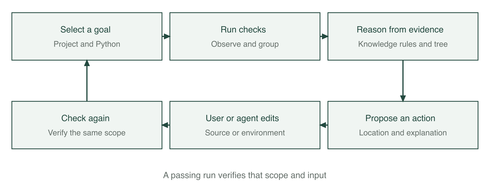
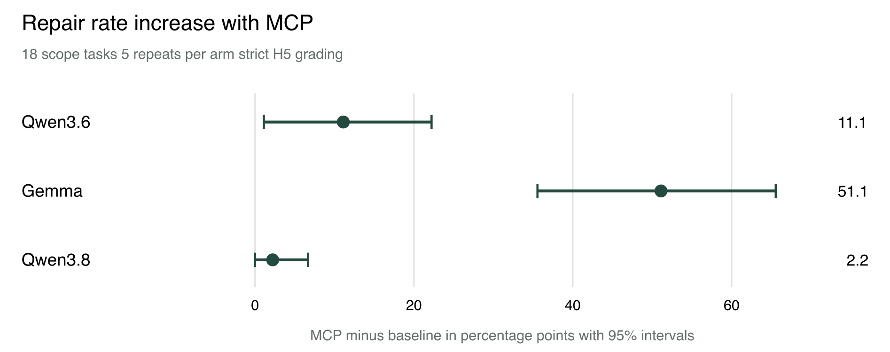

# FixFirst diagnosis and verified repair for Python projects

NUS ISS Intelligent Reasoning Systems Practice Module | Group 24

HE ZIHANG | WEI YI | CHI YONGJUN

Report version 0.2 | 9 October 2026

## 1 Executive summary

FixFirst helps a developer or coding agent understand why a Python project cannot run and decide what to fix first. It collects evidence from the project's own interpreter and checks, relates failures to dependency and API knowledge, proposes an action, and verifies the next run. Its web interface and command line serve people; its Model Context Protocol interface supplies the same diagnostic process to coding agents. FixFirst does not edit source code or install repair dependencies into the project environment. The user or agent performs the proposed changes.

The implementation combines production rules, domain and session knowledge graphs, an evidence based decision tree, and message grouping. The frozen v0.8 release candidate contains 132 rules and an 81 feature tree. The system focuses on dependencies, import paths, configuration and compatibility. A successful script execution establishes success for that entry and input; it does not establish business logic correctness.

The results show different benefits for different users and models. In the earlier twelve project evaluation of v0.7.0, four first steps were rated correct, one partial, six generic and one wrong. This exposed concrete gaps that informed subsequent development. In a separate experiment on 22 constructed tasks revealed after v0.8 was frozen, 660 paired agent runs were completed. On the 18 tasks within scope, MCP increased Gemma's strictly scored repair rate from 38.9% to 90.0%. Qwen3.6 and Qwen3.8 already solved most tasks; their clearest benefit was fewer turns, less time and fewer recorded tokens on tasks both groups could solve. These are results for the registered tasks and conditions, not a reliability estimate for arbitrary real projects. Human usability results and the registered cloud comparison are reported only when their evidence is available.

## 2 Business case market research and literature review

### 2.1 The problem

A repository may be available while its execution environment is no longer reproducible. An import failure can mean a missing distribution, a local path problem, a removed standard library name or a library version mismatch. Installing a package named after the import is therefore not always a useful first action. A passing dependency metadata check also does not establish that the application can execute.

Mukherjee, Almanza and Rubio Gonzalez examined 2,702 historical Python builds. Their PyDFix study identified 1,921 builds with dependency related reproducibility failures and obtained complete fixes for 859 of them [1]. This is evidence of a maintenance problem in that study's build datasets, rather than an estimate of the failure rate of all Python projects.

Our early thirteen project investigation similarly found that following installation instructions often did not produce a runnable test suite. Those projects became development material after their failures were inspected. The later A2 evaluation and sealed B7 tasks are distinguished from this pilot in Section 5.

### 2.2 Users and value

The initial users are students running an unfamiliar assignment, developers taking over a legacy Python repository, maintainers helping a new contributor, and researchers reproducing code. They need an executable next step supported by evidence. An agent needs that information in a compact form it can act on, together with a way to check whether the change actually worked.

For a person, the proposed value is a shorter route from traceback to a concrete action, with an explanation that can be checked. For an agent, the measured value can be a higher repair rate or fewer unsuccessful investigation steps. The agent experiment measures these outcomes separately; a reduction in turns is not assumed to imply a reduction in elapsed time.

### 2.3 Existing tools

| Tool or approach | Main role | Relationship to FixFirst |
|---|---|---|
| pip check | Check compatibility of installed dependency metadata [4] | Supplies useful evidence; it does not run the project's program or tests |
| pipdeptree | Display installed package dependency relationships [5] | Helps inspect an environment; FixFirst connects those facts to observed failures |
| Dependabot | Propose configured dependency updates [6] | Useful for maintenance; FixFirst starts from the failure in the current environment |
| Renovate | Automate dependency update workflows [7] | Complementary to diagnosing and verifying a failed local run |
| tox | Execute checks in configured environments [8] | Reproduces checks; FixFirst explains collected evidence and prioritises actions |
| General coding agents | Inspect files, edit code and execute commands | FixFirst can provide diagnostic knowledge through MCP while the agent performs repairs |

The distinction is a workflow comparison. We do not claim that existing tools are unable to diagnose errors, or that FixFirst replaces a general coding agent.

### 2.4 Relevant research

PyDFix analyses dependency related build failures and searches for version changes that restore reproducibility [1]. FixFirst shares the use of actual failure evidence and subsequent verification. Its interactive advice also includes local modules and project configuration, and its repair changes are performed by a person or agent.

DockerizeMe infers dependencies for Python code snippets using package knowledge and graph based inference [2]. Its study motivates the mapping from imported modules to distributions. FixFirst additionally checks whether the import refers to the standard library or a local project file before suggesting installation.

BugsInPy supplies real Python bugs with test suites for controlled testing and debugging research [3]. The paper reports 493 bugs in 17 projects; our repository's indexed snapshot has a different count, so these are not interchangeable denominators. It is useful for checking whether a diagnostic tool wrongly blames the environment for a code defect, but is not a balanced dataset of all five FixFirst cause classes.

These studies informed the design and evaluation sources. Their reported repair percentages are not directly comparable to our agent experiment because the tasks, interventions and success criteria differ.

### 2.5 Delivery and pricing

The submitted product is a free community implementation with local web, CLI and MCP interfaces. No paid account is required to use FixFirst's rules or classifier. A client that uses a commercial language model has its own provider charges; those are separate from FixFirst.

A possible later offer is paid maintenance and integration support, with team rule sharing or CI reporting. These are commercial hypotheses, not implemented subscriptions or validated willingness to pay. We have no customer survey from which to infer market size or revenue. The community edition and a working demonstration are the appropriate initial offer.

## 3 System design and model

### 3.1 The diagnostic loop

The user selects a project, its Python interpreter and a goal. FixFirst runs the relevant checks, groups related findings, derives evidence facts, queries domain knowledge, applies rules, orders actions and records the next verification. A later failure can become visible after an earlier collection error has been fixed. The plan is therefore recomputed after each check rather than treated as a complete list of repairs known in advance.

Figure 1. The developer or agent performs edits. FixFirst records checks, explanations and verification.

### 3.2 Evidence and root causes

The five cause classes are missing dependency, local module or import path, version incompatibility, missing configuration, and a defect in project code or tests. The last class is a diagnostic boundary: an assertion failure can require investigation of application logic that FixFirst does not attempt to repair.

Evidence includes the exception and its location, installed package metadata, static project declarations, import relationships, and the outcome of the selected program or tests. Where supported, runtime receiver identity distinguishes a real library object from a project class with the same name. Missing or over limit evidence causes the system to remain conservative.

Declarations are inspected statically; setup.py is not executed to discover requirements. A version pin, a lock file and a successful test run provide different kinds of evidence. A lock file records a chosen version, not proof that that version passes the project's tests.

### 3.3 Knowledge and rules

At frozen commit 5c224cf, the domain file contains 737 removal entries, 12 deprecation entries and 190 source records. The rule file contains 132 rules. These are entry counts, not counts of independent libraries, faults or semantically verified replacement programs. The receiver verification receipts and knowledge receipts describe what was executed; some replacement advice still lacks a dedicated semantic probe.

The production engine uses five phases: derive facts, diagnose, apply heuristics, consider a classifier fallback, and construct a plan. Rules retain their supporting facts and provenance. For example, a Python 3.12 import of collections.Mapping can be related to the removal documented for Python 3.10. The proposed source edit is to import Mapping from collections.abc. The issue is closed only after a relevant completed check succeeds.

The session graph connects goals, issues, facts, causes, rules, actions, checks and sources. It supports explanations of why a step was proposed and what remains unresolved. This graph is distinct from the domain knowledge that supplies API and distribution facts.

### 3.4 Decision tree and message grouping

The default tree is a Gini tree over 81 evidence features, with schema 8. It was trained on the fixed 215 case development dataset with maximum depth 6, minimum leaf size 2 and seed 42. Labels and parser categories are excluded from feature values. Its JSON identity is preserved by the frozen release. An older 44 feature model remains available for explicit compatibility use.

The tree supplies an unconfirmed likely cause when stronger evidence does not support a rule or heuristic. Its prediction and the product's final diagnosis are different outputs. A conservative evidence guard can suppress a confident model prediction, for example when receiver identity exceeds its bounded inspection limit.

Message grouping uses structural blocks, character n gram TF IDF, cosine similarity and complete link grouping with threshold 0.82. The committed collection and execution checks obtained the same pairwise scores as exact text grouping. They support correct operation on those controlled inputs, not a measured advantage for the similarity method.

### 3.5 Ordering and verification

Actions are ordered using preconditions, goal impact, evidence strength and cost. The first action is intended to be executable or to explain a constraint that needs review. Version suggestions must respect project declarations. If a declaration excludes the compatible range, an incompatible installation command is not presented as a repair.

Verification binds the goal, interpreter and execution scope. A completed passing test run is different from a cancelled, partial or collection only check. For a script, success applies to the saved entry, arguments and standard input. Editing tests or protected selection settings does not establish that the original problem was repaired.

### 3.6 Interfaces and course techniques

The web interface explains actions and exposes their evidence. The CLI supports repeatable checks and export. The MCP server exposes diagnose, check_again and explain over stdio. Its responses put an action before supporting explanation; the client agent retains responsibility for edits.

| Course technique group | Implementation | Demonstrated role |
|---|---|---|
| Decision automation | Forward chaining production rules | Derive causes and actions under explicit conditions |
| Knowledge discovery and data mining | Gini tree and TF IDF grouping | Generalise from evidence and group similar messages |
| Cognitive techniques and knowledge representation | Domain and session knowledge graphs, explanations | Connect observations, knowledge, actions and sources |
| Resource optimisation contribution | Bounded release search | Explore compatible versions within a trial budget; no claim of A star or evolutionary optimisation |

## 4 System development and implementation

### 4.1 Components and engineering process

The implementation separates execution and observation, static project inspection, domain loading, inference, action planning, verification, web presentation and MCP transport. This separation allows diagnosis to be replayed from saved observations without executing a project again.

Development proceeded through concrete failure analysis. Later improvements covered old test tools on new interpreters, Django settings, source only distributions, receiver attribution, constrained setuptools repair and local import roots. Product outputs were checked by independent acceptance scripts and registered positive and negative examples. Broad knowledge expansion alone did not address all observed failures; obtaining the right runtime evidence and presenting a usable action were also necessary.

The tree was expanded from 44 to 81 evidence features while preserving the original training records. Its integration report records a development comparison of 134 versus 186 correct predictions out of 215 when a scene was left out. That is a tree component comparison under those recorded conditions, not an increase in end to end repair rate on new projects.

### 4.2 Verification and operational limits

The application records process outcomes and uses timeouts. Diagnostic checks execute project code, as the project's tests or program would. Users should therefore check projects they trust. Source changes and dependency installations remain visible user or agent actions. Optional release search uses an isolated trial environment and its results apply only to the tested import and conditions.

Inspection is bounded. The additional import root index is disabled when the source file limit is reached, and receiver inspection has limits. A generic step in such a case is preferable to an unsupported install command, but can still cost a user or agent extra work. Interpreter changes, protected test changes and omitted pytest options are surfaced rather than silently treated as equivalent verification.

Windows specific adapters and commands are implemented. The evidence in this report includes macOS checks and recorded CI or regression artifacts; it does not substitute for final Windows real-device acceptance.

### 4.3 Frozen evaluation identity

The agent experiment uses tag b7-freeze-20261007 at commit 5c224cf, package version 0.8.0rc2. Product, runner, model and task identities were recorded before evaluation. The default model is the 81 feature tree. Earlier A2 and B3 results retain their own version and evidence identities and are not relabelled as results of this release.

AI assistants supported implementation, documentation and evidence checks. Human team members retain responsibility for the submitted system and claims. The assistance and review process is disclosed in Appendix E.

## 5 Experiments

### 5.1 Data roles and research questions

The experiments address different questions: whether the cause category is correct, whether a human judges the first step useful, and whether an agent actually repairs a project under a registered rule. Those measures are reported separately.

| Material | Size | Use and evidence status |
|---|---:|---|
| Fixed execution based training records | 215 | Train the default tree; development data |
| B3 ordinary and difficult cases | 220 and 30 | One shot category comparison on training related and development scenarios |
| A2 real projects | 12 | Earlier v0.7.0 first step assessment; labels before running |
| B7 public development pack | 12 | Calibrate the runner and product; excluded from formal evaluation |
| B7 sealed evaluation pack | 22 | Revealed after product freeze; 18 scope tasks plus four controls |
| BugsInPy and upstream defects | Recorded reproduction artifacts | Verification feasibility; full B12 phase two remains outstanding |
| User study fixtures | Example rows only | Validate analysis scripts; no participant outcome claims |

Repeated runs of a task do not make it a new project. The sealed B7 pack consists of constructed programs using known failure mechanisms. It supplies an independent instance test after freezing, not a random sample of all real repositories.

### 5.2 Generated diagnosis and ablation results

The historical 44 feature evaluation reported hybrid accuracy of 0.930 when leaving out a failure scenario and 1.000 when leaving out a project template. The same materials influenced rules and knowledge, so these are internal development estimates. They are retained as historical results rather than recalculated or attributed to the frozen 81 feature model.

The ablation study reported 0.488 for rules without domain knowledge, 0.791 for rules with knowledge, and 0.828 after heuristics. The decision tree alone achieved 0.609 in the scenario split. This supports complementary component roles under that protocol. It does not establish that a particular component contributes the same amount on arbitrary project failures.

### 5.3 A2 real project advice

The recorded A2 result for v0.7.0 was four correct, one partial, six generic and one wrong first step out of twelve projects. The set includes one healthy project. Independent scoring agreed on 9 of 12 rows, or 75%, with Cohen's kappa 0.66; the original independent sheets were preserved when the three disagreements were reconciled.

The misses included old pytest or tooling failures, Django configuration, a platform specific date format, a source build requirement and an application logic defect. A cause category without a named usable next action was rated generic. This explains why 8 of 11 fault categories could match while only 4 of 12 first steps were rated correct. Cause recognition and useful advice are different outcomes.

These failures later informed v0.8 development. Replays or repairs on those same projects must consequently be reported as development comparisons. The A2 result is not replaced by the newer synthetic repair rate.

### 5.4 B3 one shot language model comparison

In the real project batch, each model answered twelve prompts without tools or an opportunity to execute its advice. There were 36 original requests and five technical missing answers, which remained in the complete denominator. Human reviewed first steps were compared with the earlier A2 product output.

| Method | Correct causes out of 11 faults | Correct advice out of 12 requests | Technical missing answers |
|---|---:|---:|---:|
| Qwen3.6 | 9 | 6 | 1 |
| Qwen3.8 | 8 | 5 | 2 |
| Gemma | 3 | 0 | 2 |
| FixFirst v0.7.0 | 8 | 4 | 0 |

Advice rating agreement on available model answers was 29/31, with kappa 0.904. This was AI assisted drafting with human row review, not wholly unaided human assessment. Five missing answers were excluded from the agreement calculation, not treated as agreement. The model evidence was a bounded, redacted presentation of initial checks; the A2 product could also use its follow-up release search. The comparison is therefore not byte identical input or identical operation access.

The separate 750 request generated batch used 250 cases per model, deterministic decoding, no tools and no retries. Its ordinary and difficult category counts are below. The FixFirst comparison replays saved observations with the recorded older versions.

| Method | Ordinary correct out of 220 | Difficult correct out of 30 |
|---|---:|---:|
| FixFirst v0.7.0 | 220 | 30 |
| Recorded v0.8 candidate ff92446 | 215 | 30 |
| Qwen3.6 | 203 | 15 |
| Gemma | 213 | 15 |
| Qwen3.8 | 216 | 18 |

The candidate abstained on five old unittest alias observations without receiver attribution; these were counted as wrong rather than supplied with new evidence. The difficult product result includes heuristic suggestions, not thirty rule confirmed diagnoses. The generated and difficult materials are development related and do not show superiority on unseen real projects. This table measures category prediction, not repair success. Its older candidate is not the final 81 feature release.

### 5.5 B7 executed agent repair

The principal agent experiment compares the same local model with general file and command tools, either without FixFirst or with its MCP tools. The 22 task pack contains A dependency and version bounds, B removed APIs, C project configuration and layout, D combined faults, and E/F controls. The main analysis uses the 18 A to D tasks. Each model runs each arm five times, making 660 runs in total and 90 runs per arm in the scope analysis.

The product was frozen before the evaluation pack was revealed. Both arms share task descriptions, budget and H5 protection rules. Runs use at most 30 turns and 900 seconds, a 32,768 output token limit, up to three reminders, and the registered file tools. Paired arms share a seed identifier and alternate order. Prompt caching is enabled under a verified memory and SSD scheme, with a fresh cache at each run. MTP is disabled for all three models. Sampler settings differ by model and are held constant between that model's arms.

H5 protects test content, collection and result settings. Only pythonpath and DJANGO_SETTINGS_MODULE pytest configuration changes are allowed, with existing configuration carriers and collected nodes checked. A protected edit during the run is a strict failure even if the agent later restores it. The same restrictions are stated to both arms.

| Model | Baseline repaired out of 90 | MCP repaired out of 90 | Increase in percentage points with 95% interval |
|---|---:|---:|---|
| Qwen3.6 | 79 or 87.8% | 89 or 98.9% | 11.1 [1.1, 22.2] |
| Gemma | 35 or 38.9% | 81 or 90.0% | 51.1 [35.6, 65.6] |
| Qwen3.8 | 84 or 93.3% | 86 or 95.6% | 2.2 [0.0, 6.7] |

Figure 2. Paired task bootstrap intervals for MCP minus baseline. The unit represented by the interval is the task, not 90 independent projects.

Qwen3.6's rate difference depends on strict protection. Under the registered sensitivity reading that permits a run whose sole violation was another pytest option, the rates are 96.7% and 98.9%, a 2.2 point increase with an interval of -2.2 to 6.7. The final compliant state reading gives 94.4% versus 100.0%. Both are reported alongside the primary result, not substituted for it after observing the data.

Gemma's increase remains under the alternative readings. It improves on sixteen tasks and declines on one. Qwen3.8's ten unrepaired scope runs were all timeouts, eight concentrated in one task. Its repair rate difference does not establish a clear gain. Three Gemma MCP runs ended early after exhausting reminders; they were retained as failures, without retry or a changed reminder budget.

Efficiency is computed on tasks with at least three successful runs in each arm. Each task contributes the ratio of its successful run medians; the table takes a geometric mean across tasks. A value below one means fewer resources. Tokens include recorded input and output, including cached input, and are not a bill or a direct computation measure.

| Model | Tasks | Turn ratio with 95% interval | Time ratio with 95% interval | Token ratio with 95% interval |
|---|---:|---|---|---|
| Qwen3.6 | 15 | 0.54 [0.43, 0.69] | 0.46 [0.38, 0.56] | 0.36 [0.28, 0.46] |
| Gemma | 7 | 0.55 [0.34, 0.90] | 1.03 [0.72, 1.43] | 0.63 [0.37, 1.04] |
| Qwen3.8 | 17 | 0.82 [0.68, 0.98] | 0.73 [0.60, 0.89] | 0.74 [0.59, 0.91] |

Gemma does not save elapsed time on the seven tasks both arms can solve. The separately registered all-task reading imputes a 900 second limit to unsuccessful runs; its much smaller Gemma time ratio mainly reflects failures in the baseline, not faster successful repair. For the two Qwen models, all three successful-task intervals are below one.

Controls are separate. Both Qwen models score 100% in both arms on E and F. Gemma scores 80% in both arms on E, and 100% versus 80% on F; the F decline comes from two early endings. No benefit outside the intended scope is claimed.

The batch ran once without infrastructure interruption, retry or loss. Independent recomputation matched the saved analysis, and archived responses were matched to service records. This supports the integrity of the recorded comparison. A registered 132 run DeepSeek Flash extension is separate and has no result in this version of the report.

### 5.6 Grouping verification and remaining evaluations

The committed controlled grouping results have precision and recall 1.0 for both exact matching and TF IDF: 15 positive pairs in collection and five in execution, with no recorded false positive or false negative. The templates and error blocks restrict variation, so these results do not demonstrate a similarity grouping advantage.

B12 phase one records bug reproduction rather than a completed FixFirst before and after verification study. The full phase two analysis and B17 next-step ordering ablation remain separate tasks. Their intended questions are whether an issue stays open before the genuine repair and whether ranking changes the number of invalid actions; no outcome is inferred from the implemented feature alone.

The user study protocol records completion, elapsed time, cause explanations and SUS responses. The repository currently supplies demonstration fixtures for its analysis program. They are not participant data. We do not report a SUS score or a human time saving until the real sessions have been completed and reviewed. Final Windows installation and end to end acceptance likewise require a teammate's real machine.

## 6 Findings and discussion

### 6.1 Findings

Specific, executable advice matters more than merely choosing the right cause class. A2 exposed a gap between category recognition and useful first steps. Receiver attribution, constrained dependency ranges and persistent project configuration were therefore developed and verified as product mechanisms.

MCP's measured benefit depends on the agent. Gemma gains repair capability on the registered scope tasks. The two Qwen models already have high baseline repair rates; their clearer gain is efficiency. A faster or stronger baseline can leave little room for an additional tool to raise repair rate. This does not justify omitting the baseline or choosing tasks after seeing the formal result.

The tree is one part of a hybrid product. Its component prediction improves on development cases, but a rule can determine the first action regardless of the tree. Category accuracy alone is therefore insufficient to evaluate the user or agent experience.

### 6.2 Limitations

The formal pack comprises only eighteen scope tasks and four controls, with five repeats per arm. Tasks were constructed from selected failure mechanisms, and the developer and independent reviewer both used AI assistance. New task instances and preregistration reduce some bias but do not establish general real-world reliability.

H5 is stricter than ordinary software maintenance. It disallows some otherwise valid ways to persist configuration and penalises edits later reverted. Reporting the sensitivity readings is essential, especially for Qwen3.6. Efficiency is also conditioned on successful tasks and needs its denominators.

The one shot comparisons use a bounded representation of check evidence, whereas the product has structured records and knowledge. Older saved observations may lack newly required provenance. Technical missing answers, output parsing and shared local service behaviour affect those results. No cross-provider speed or price ranking is inferred from the experiments.

Knowledge coverage is finite. Some supported library changes are inferred from heuristics, and not every replacement sentence has an execution probe. Bounded project inspection can miss unusual layouts or runtime objects. Source builds, interactive programs, long-running services and unsupported settings may require human review. Passing one run does not prove correctness over all inputs.

Human usability and final Windows acceptance remain evidence gaps. An 80% universal reliability claim would not follow from the recorded synthetic repair percentages.

### 6.3 Deviations from the proposal and next work

PyDFix was retained as motivation and an external source, while executed generated cases and real project records became the main diagnostic materials. BugsInPy was used first to establish reproduction feasibility. Baseline work expanded into distinct one shot diagnosis and MCP assisted repair comparisons. Direct program and unittest execution were added to support projects without pytest tests.

The next priorities are to finish the cloud extension under its registered conditions, complete the real user sessions and Windows checks, and close the outstanding verification and ordering studies. Product or model changes after the evaluation freeze must be evaluated as a new version with newly separated development and test evidence.

## References

[1] S. Mukherjee, A. Almanza and C. Rubio Gonzalez. 2021. Fixing Dependency Errors for Python Build Reproducibility. ISSTA 2021, 439-451. DOI 10.1145/3460319.3464797. Author copy: https://web.cs.ucdavis.edu/~rubio/includes/issta21.pdf.

[2] E. Horton and C. Parnin. 2019. DockerizeMe Automatic Inference of Environment Dependencies for Python Code Snippets. arXiv:1905.11127. https://arxiv.org/abs/1905.11127.

[3] R. Widyasari et al. 2020. BugsInPy A Database of Existing Bugs in Python Programs to Enable Controlled Testing and Debugging Studies. ESEC/FSE 2020, 1556-1560. DOI 10.1145/3368089.3417943. Author preprint: https://arxiv.org/abs/2401.15481.

[4] pip documentation. pip check. https://pip.pypa.io/en/stable/cli/pip_check/. Accessed 9 October 2026.

[5] tox developers. pipdeptree. https://github.com/tox-dev/pipdeptree. Accessed 9 October 2026.

[6] GitHub documentation. Dependabot options reference. https://docs.github.com/en/code-security/reference/supply-chain-security/dependabot-options-reference. Accessed 9 October 2026.

[7] Renovate documentation. https://docs.renovatebot.com/. Accessed 9 October 2026.

[8] tox documentation. https://tox.wiki/en/stable/. Accessed 9 October 2026.

Project result identities, files and calculation sources are registered in docs/report/SOURCES.md and docs/report-assets/B11-results-20261009.json. B3 result packages are identified by fixed commits in that register, including material awaiting publication merge.

## Appendix A Project proposal

The original submitted proposal is to be included unchanged in the final submission. The discussion records how the implementation and evaluation developed beyond the proposal. The submission checklist requires the original attachment rather than regenerating it from this report.

## Appendix B Mapping to MR RS and CGS

| Function | Knowledge or technique | Module mapping |
|---|---|---|
| Evidence to causes and actions | Production rules, forward chaining and explanation | MR |
| Learned likely cause | Supervised Gini tree, validation and ablation | MR and RS |
| Action priority and release search | Decisions under goals, constraints and bounded trial budgets | RS |
| Domain and session relationships | Knowledge graphs and graph traversal | CGS |
| Repeated error grouping | Text features, similarity and clustering | CGS |
| Web and MCP interaction | Explanations and feedback after a check | CGS |

This mapping follows the team's course alignment record. It does not label the bounded version search as A star or evolutionary computing.

## Appendix C Installation and user guide

The following guide is also supplied at docs/USER_GUIDE.md. It includes the actual sample repair, direct program execution, CLI commands and MCP configuration. Its frozen product identity is the same as the B7 release. Independent installation checks remain part of the submission checklist.

<!-- include: ../USER_GUIDE.md -->

## Appendix D Individual reports

HE ZIHANG, WEI YI and CHI YONGJUN each write their own reflection and peer evaluation according to the course submission instructions. This report does not generate or substitute those personal accounts.

## Appendix E AI usage statement

Codex and Claude assisted with software implementation, documentation drafts, research checking, experiment preparation and evidence review. Local language models were evaluated as one shot respondents and coding agents; their outputs were retained as experimental data. AI assisted label or score drafts were reviewed by the human team, and the original independent and consensus records were kept where applicable.

The team reviews generated code and claims using source inspection, real execution, regression checks and independent acceptance. Independent AI recomputation is described as such; it is not represented as independent human replication. Real participants, human scoring decisions, final Windows operation, video narration and personal reflections remain the responsibility of the people concerned. No AI generated narration or participant result is supplied as a human contribution.
