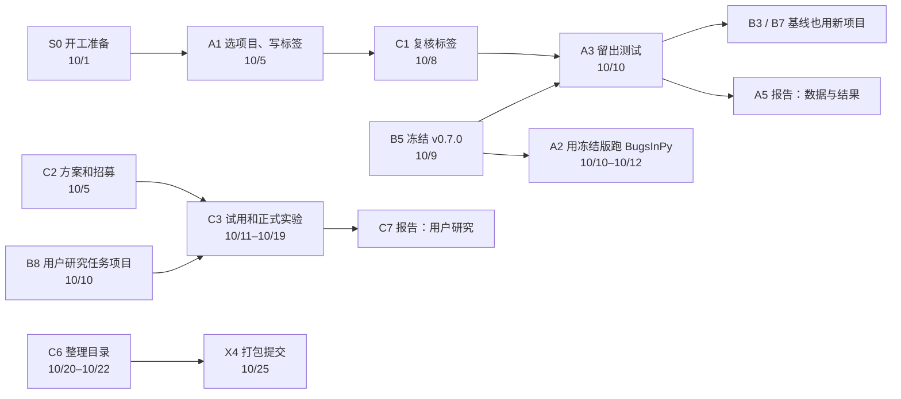

# FixFirst 任务清单（9/29 → 10/25）

[后续计划](../后续计划.md)讲要做什么、为什么这样做；这里把它拆成可以认领的任务。每个任务一张卡片，写明：

- 为什么要做；
- 必须遵守什么；
- 每一步怎么做，命令可以直接复制；
- 交什么，放在哪里；
- 怎样算完成。

认领以后，照着卡片和仓库就能做，不用再来回问。卡片写错了或者和实际对不上，直接在对应的 Issue 里指出，B 会改卡片。

## 怎么开始

1. 所有人先做 [S0 开工准备](S0-setup.md)，大约 1–2 小时：加入仓库、装好环境、跑通测试、学会提 PR。
2. **认领任务**：到仓库的 Issues 页面找到任务编号对应的 Issue，在右侧的 Assignees 里选自己。如果 Issue 还没建，在群里说一声，B 会在下面总表的"谁"一栏填上名字。
3. **做任务**：照卡片一步步做。每张卡片最后都有"完成标准"，交付时把它复制到 PR 或 Issue 里，逐条打勾。
4. **卡住了**：卡住超过半天，就在 Issue 里写清楚做到了哪一步，贴上完整的命令和完整的报错，格式见 S0 第 8 节。不要为了绕过去改规矩、改标签。
5. **报进度**：每周一晚上开周会之前，在自己负责的 Issue 里更新一句进度。

## 谁负责什么

| 角色 | 负责 | 谁 |
|---|---|---|
| **A 数据和证据** | 新真实项目和标签、BugsInPy 验证、留出测试、报告的数据章节 | 待定（WEI YI 或 CHI YONGJUN） |
| **B 推理和模型，兼整合** | 规则、知识库、决策树、冻结版本、评估和基线、合并所有 PR、报告的系统章节 | HE ZIHANG |
| **C 用户和交付** | 标签复核、用户研究、Windows 验收、使用指南、仓库整理、报告的商业和用户章节、宣传视频 | 待定（另一位，最好是有 Windows 电脑的那位） |

A 和 C 的人选由 WEI YI、CHI YONGJUN 商定后告诉 B。按估计，A 大约 45 小时，C 大约 65 小时。A 做完 A3 以后，可以接手 C5 或 C8 的一部分，在周会上调整。

## 四条规矩

1. **冻结前，B 不能看到新项目。** 新真实项目的名单、pytest 输出和标签只放在 A 的私有仓库里，只在 A 和 C 之间传，一直到 10/10 留出测试跑完为止。不要发到群里，不要放进公开仓库，不要给 B 看，也不要发给任何 AI 助手。否则留出测试就不算数了。
2. **有些事只能由人来做**：写标签、复核标签、给结果打分、视频旁白、个人反思。可以查文档，可以动手试，但不要让 AI 直接给出答案。
3. **代码只从一个入口合并。** 所有改动都走分支加 PR，由 B 合并。不要直接推 main，也不要 force push。
4. **公开仓库里不放个人信息**：不放参与者名字，不放邮箱、电话、密钥，也不放本机路径（脚本会自动把家目录写成 `<home>`）。学号要不要写进 README，在 C6 里统一决定。

## 任务总表

| 编号 | 任务 | 负责 | 截止 | 预计用时 | 要先完成 | 谁 |
|---|---|---|---|---|---|---|
| [S0](S0-setup.md) | 开工准备：加入仓库、装环境、跑测试、学会 PR | 全员 | 10/1（四） | 1–2 小时 | — | |
| [A1](A1-heldout-projects.md) | 新真实项目：挑选、搭环境、写标签 | A | 10/5（一） | 15–20 小时 | S0 | |
| [C1](C1-label-review.md) | 标签复核：独立标注、对比、定稿 | C | 10/8（四） | 4–6 小时 | A1 | |
| [A2](A2-bugsinpy.md) | BugsInPy 真实缺陷验证 | A | 10/9 复现完；10/12 交结果 | 6–8 小时 | S0；交结果要等 B5 | |
| [A3](A3-heldout-run.md) | 冻结版本上的留出测试和评分 | A（C 复评） | 10/10 运行；10/12 交 PR | 4–6 小时 | A1、C1、B5 | |
| [A4](A4-pydfix-labels.md) | （可选）PyDFix 22 个案例的标注 | A | 10/12 | 2–3 小时 | — | |
| [A5](A5-report-data.md) | 报告：数据与标注、真实项目结果、文献综述 | A | 初稿 10/19；定稿 10/23 | 约 10 小时 | A3 | |
| [C2](C2-user-study-plan.md) | 用户研究：方案、知情同意书、招募 | C（全员帮忙找人） | 方案 10/5；人选 10/10 | 6–8 小时 | — | |
| [C3](C3-user-study-run.md) | 用户研究：试用、正式实验、分析 | C（A 协助计时） | 试用 10/12；正式 10/13–10/19；分析 10/21 | 15–20 小时 | C2、B8 | |
| [C4](C4-windows-check.md) | Windows 验收：冻结版和最终版 | C | 10/11；10/23 | 每次 2–3 小时 | B5 | |
| [C5](C5-user-guide.md) | 安装和使用指南（报告附录） | C | 初稿 10/19；定稿 10/22 | 6–8 小时 | 定稿在 C6 之后 | |
| [C6](C6-template-layout.md) | 按课程示例整理仓库目录 | C | 10/22 | 3–4 小时 | B 宣布代码定稿（约 10/20） | |
| [C7](C7-report-business.md) | 报告：商业价值、市场调研、用户研究 | C | 初稿 10/19；定稿 10/23 | 约 10 小时 | C3 | |
| [C8](C8-promo-video.md) | 宣传视频（5 分钟，真人旁白） | C（其他人可以参与配音） | 脚本 10/19；成片 10/24 | 约 10 小时 | — | |
| [B1–B11](B-tasks.md) | 规则和知识、冻结、评估、基线、用户研究任务项目、合并、系统章节 | B | 见卡片 | — | — | HE ZIHANG |
| [X1–X5](X-team.md) | 周会、系统视频、个人反思和同伴评价、打包提交、考试准备 | 全员 | 见卡片 | — | — | 全员 |

## 先后关系

## 关键日期

| 日期 | 要交的 |
|---|---|
| 10/1（四） | S0 全员完成；B 加好协作者，建好 Issues |
| 10/5（一） | A1：A 在 Issue 里贴出私有仓库的提交号（标签写完）；C2 方案初稿 |
| 10/8（四） | C1：C 贴出最终标签的提交号 |
| 10/9（五） | B5 冻结 v0.7.0；A2 复现部分完成 |
| 10/10（六） | A3 留出测试；A2 用冻结版运行；B8 交出用户研究任务项目；C4 验收冻结版 |
| 10/12（一） | A2、A3 结果 PR；C3 试用完成；B 的评估和基线 |
| 10/13–10/19 | 正式用户研究；报告初稿（10/19）；两个视频的脚本（10/19） |
| 10/20–10/22 | C6 整理目录；C5 定稿；录视频 |
| 10/23（五） | 报告定稿；C4 验收最终版 |
| 10/24（六） | 视频成片；个人反思；打好提交包 |
| 10/25（日）23:59 | 组长上传到 Canvas；每人各自提交同伴评价 |

## 卡片里的约定

- 主仓库默认放在 `~/FixFirst`（macOS / Linux）或 `C:\dev\FixFirst`（Windows），放在别处时把命令里的路径换掉。
- 命令先写 macOS / Linux 版（bash 或 zsh），和 Windows 不同的地方再写一份 PowerShell 版。
- 命令里 `<…>` 的部分要连同尖括号一起换成实际的值，例如 `<id>` 换成 `flask-sqlalchemy`。PowerShell 会把没换掉的 `<` 当成语法错误。
- "私有仓库"指 A 在自己账号下建的 `fixfirst-heldout`，只邀请 C。
- CSV 文件用 UTF-8 编码。用 Excel 打开时，如果中文变成乱码，改用"数据 → 从文本/CSV"导入，编码选 UTF-8；也可以直接用 VS Code 或 Google Sheets 编辑。标签和打分尽量用英文写，方便直接放进报告。
- 脚本的用法都写在各自文件的开头；在主仓库里运行 `.venv/bin/python scripts/<脚本名>.py -h` 可以看到全部参数。
