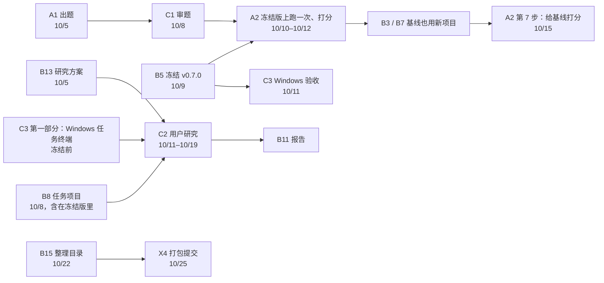

# FixFirst 任务清单（9/29 → 10/25）

[后续计划](../后续计划.md)讲要做什么、为什么这样做；这里把它拆成可以认领的任务。每个任务一张卡片，写明：

- 为什么要做；
- 必须遵守什么；
- 每一步怎么做，命令可以直接复制；
- 交什么，放在哪里；
- 怎样算完成。

认领以后，照着卡片和仓库就能做，不用再来回问。卡片写错了或者和实际对不上，直接在对应的 Issue 里指出，B 会改卡片。

## 分工原则

**能由 AI 辅助完成的都归 B；A 和 C 只做必须由人完成的事**：

- 出题标注、复核、打分；
- 用户研究的现场实验；
- Windows 电脑上的验收；
- 视频旁白；
- 个人反思。

最核心的一段是新项目的留出测试。规则是 B（和 AI）写的，所以题目必须由别人出：

1. A 挑新项目、写标准答案；
2. C 独立复核；
3. B 冻结版本；
4. A 用冻结版只跑一次并打分，C 复评。

冻结前 B 看不到这批项目。

## 谁负责什么

| 角色 | 负责 | 谁 |
|---|---|---|
| **A 出题和阅卷** | 挑新的真实项目，写标准答案；用冻结版跑一次并打分；给大模型基线的回答打分；（可选）PyDFix 标注；录系统视频里"数据和实验"那段旁白 | 两位队友商定 |
| **C 审题和用户** | 独立复核 A 的答案；和 A 各自打分；用户研究的招募和现场实验；Windows 电脑上验收；录宣传视频的旁白 | 两位队友商定（有 Windows 电脑的那位更合适） |
| **B 其余全部**（AI 协助） | 规则、知识库、决策树、MCP；冻结版本；评估和基线；BugsInPy 验证；用户研究的方案和分析；使用指南；整理仓库；报告全文；两个视频的脚本和剪辑；合并所有 PR | HE ZIHANG |

GitHub 账号：HE ZIHANG 是 `ZihangHe13123`；两位队友是 `creazydiamond` 和 `StupidGuy1122`（WEI YI）。A 和 C 定下来以后，到 Issues 里把自己的任务 Assignees 设成自己。A 和 C 的工作量各约 25–35 小时，大部分集中在 10/1–10/19。

## 怎么开始

1. 先做 [S0 开工准备](S0-setup.md)，大约 1–2 小时：接受仓库邀请、装好环境、跑通测试、学会提 PR。
2. **认领任务**：到仓库的 Issues 页面找到任务编号对应的 Issue，在右侧的 Assignees 里选自己。
3. **做任务**：照卡片一步步做。每张卡片最后都有"完成标准"，交付时把它复制到 PR 或 Issue 里，逐条打勾。
4. **卡住了**：卡住超过半天，就在 Issue 里写清楚做到了哪一步，贴上完整的命令和完整的报错，格式见 S0 第 8 节。不要为了绕过去改规矩、改标签。
5. **报进度**：每周一晚上开周会之前，在自己负责的 Issue 里更新一句进度。

## 四条规矩

1. **冻结前，B 不能看到新项目。** 新真实项目的名单、pytest 输出和标签只放在 A 的私有仓库里，只在 A 和 C 之间传，一直到 A2 的结果合并为止。不要发到群里，不要放进公开仓库，不要给 B 看，也不要发给任何 AI 助手。否则留出测试就不算数了。
2. **只能由人来做的事，不要交给 AI**：写标签、复核标签、给结果打分、带用户研究、视频旁白、个人反思。可以查文档，可以动手试，但不要让 AI 直接给出答案。
3. **代码只从一个入口合并。** 所有改动都走分支加 PR，由 B 合并。不要直接推 main，也不要 force push。
4. **公开仓库里不放个人信息**：不放参与者名字，不放邮箱、电话、密钥，也不放本机路径（脚本会自动把家目录写成 `<home>`）。学号要不要写进 README，在 10/19 的周会上统一决定。

## A 和 C 的任务

| 编号 | 任务 | 负责 | 截止 | 预计用时 | 要先完成 |
|---|---|---|---|---|---|
| [S0](S0-setup.md) | 开工准备：接受邀请、装环境、跑测试、学会 PR | A、C | 10/1（四） | 1–2 小时 | — |
| [A1](A1-heldout-projects.md) | 新真实项目：挑选、搭环境、写标签 | A | 10/5（一） | 15–20 小时 | S0 |
| [C1](C1-label-review.md) | 标签复核：独立标注、对比、定稿 | C | 10/8（四） | 4–6 小时 | A1 |
| [A2](A2-heldout-run.md) | 冻结版上的留出测试和打分；给大模型基线打分 | A（C 独立复评） | 运行 10/10；PR 10/12；基线打分 10/15 | A 5–7 小时，C 3 小时 | A1、C1、B5；第 7 步等 B3 |
| [A3](A3-pydfix-labels.md) | （可选）PyDFix 22 个案例的标注 | A | 10/12 | 2–3 小时 | — |
| [C2](C2-user-study-sessions.md) | 用户研究：招募、试用、正式实验 | C（全员帮忙找人） | 招募今天开始；试用 10/12；正式 10/13–10/19 | 15–20 小时 | 实验要等 B13、B8 |
| [C3](C3-windows-check.md) | Windows 验收：用户研究的任务终端、冻结版、最终版 | C | 任务终端尽量 10/9 前；冻结版 10/11；最终版 10/23 | 每次 2–3 小时 | 任务终端无（PR #32 已合并）；冻结版等 B5；最终版等 B15 |
| [X1–X5](X-team.md) | 周会、两个视频的旁白、个人反思和同伴评价、打包提交、考试准备 | 全员 | 见卡片 | — | — |

B 的任务（B1–B17）和推进顺序见 [B 的任务](B-tasks.md)。

## 先后关系

## 关键日期

| 日期 | 要交的 |
|---|---|
| 10/1（四） | S0：A、C 接受邀请、跑通测试 |
| 10/5（一） | A1：A 在 Issue 里贴出私有仓库的提交号；B13：用户研究方案 |
| 10/8（四） | C1：C 贴出最终标签的提交号；B8 用户研究的任务项目已于 9/29 合并（PR #32） |
| 10/9（五）前 | C3 第一部分：C 在 Windows 上验收用户研究的任务终端和判分（尽量在冻结前） |
| 10/9（五） | B5 冻结 v0.7.0 |
| 10/10（六） | A2 运行；C3 验收冻结版 |
| 10/12（一） | A2 结果 PR；C2 试用完成 |
| 10/13–10/19 | C2 正式用户研究；10/15 前 A、C 给大模型基线打分；B 写报告初稿 |
| 10/20–10/22 | A、C 录旁白；B15 整理目录 |
| 10/23（五） | 报告定稿；C3 验收最终版 |
| 10/24（六） | 视频成片；个人反思；打好提交包 |
| 10/25（日）23:59 | 组长上传到 Canvas；每人各自提交同伴评价 |

## 冻结前还缺什么（9/29 晚）

10/9 冻结 v0.7.0。下面是冻结前还没完成、又会卡住后面工作的事，按先后排：

| 事项 | 负责 | 现在 | 要先完成 | 截止 |
|---|---|---|---|---|
| S0 开工准备 | A、C | 两人都已接受邀请；creazydiamond 在 #1 里回复了截图，StupidGuy1122 还没有记录 | — | 10/1（四） |
| 认领 C 的任务（C1、C2、C3） | C | 还没人认领 | S0 | 越早越好 |
| C2 第 1 步：发招募消息 | C（全员帮忙找人） | 还没开始 | — | 现在 |
| C3 第一部分：Windows 上验收任务终端和判分 | C | 还没开始 | — | **建议 10/6 前**，最晚 10/9。发现的问题冻结前修好才能进 v0.7.0 |
| A1 新项目和标签 | A | 进行中 | S0 | 10/5（一） |
| C1 独立复核、定稿 | C | 还没开始 | A1 | 10/8（四） |
| B5 冻结 | B | 还没开始 | B2、B4、B8 已合并；C3 第一部分发现的问题已修 | 10/9（五） |

冻结后才开始的：A2（10/10 运行）、C3 冻结版验收、C2 试用和正式实验、B 的各项正式实验。B 冻结前的准备工作见 [B 的任务](B-tasks.md)的"推进顺序"。

## 卡片里的约定

- 主仓库默认放在 `~/FixFirst`（macOS / Linux）或 `C:\dev\FixFirst`（Windows），放在别处时把命令里的路径换掉。
- 命令先写 macOS / Linux 版（bash 或 zsh），和 Windows 不同的地方再写一份 PowerShell 版。
- 命令里 `<…>` 的部分要连同尖括号一起换成实际的值，例如 `<id>` 换成 `flask-sqlalchemy`。PowerShell 会把没换掉的 `<` 当成语法错误。
- "私有仓库"指 A 在自己账号下建的 `fixfirst-heldout`，只邀请 C。
- CSV 文件用 UTF-8 编码。用 Excel 打开时，如果中文变成乱码，改用"数据 → 从文本/CSV"导入，编码选 UTF-8；也可以直接用 VS Code 或 Google Sheets 编辑。标签和打分尽量用英文写，方便直接放进报告。
- 脚本的用法都写在各自文件的开头；在主仓库里运行 `.venv/bin/python scripts/<脚本名>.py -h` 可以看到全部参数。
- 任务编号在 9/29 调整过一次（分工改为"能由 AI 辅助的都归 B"）。旧编号对照：A2→B12、A3→A2、A4→A3、A5 和 C7→B11、C2→B13、C3→C2、C4→C3、C5→B14、C6→B15、C8→B16。
